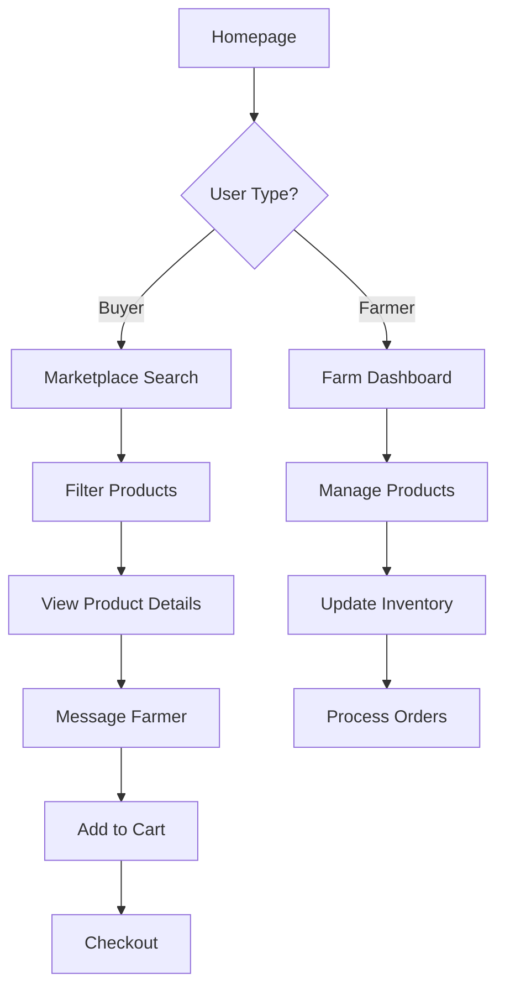

# 🚜 Farmer Lookup - Local Food Marketplace Platform

A comprehensive web application connecting local farmers with buyers, built with **PHP + MongoDB** backend and **HTML/CSS/JavaScript** frontend featuring an agricultural color palette and complete marketplace functionality.


## 🌾 **Core Value Proposition**

Farmer Lookup eliminates the middleman by providing farmers with digital tools to manage their business while offering buyers transparent, hyper-local access to fresh produce. The platform focuses on **efficiency**, **trust**, and **community impact**.

---

## 📋 **Table of Contents**

- [Features Overview](#-features-overview)
- [Technical Architecture](#-technical-architecture)
- [Installation & Setup](#-installation--setup)
- [How to Use](#-how-to-use)
- [API Documentation](#-api-documentation)
- [File Structure](#-file-structure)
- [Color Palette & Design](#-color-palette--design)
- [Database Schema](#-database-schema)
- [Configuration](#-configuration)
- [Troubleshooting](#-troubleshooting)

---

## 🎯 **Features Overview**

### **1. Farmer Profile & Catalog - "The Digital Farmstand"**
- ✅ User-friendly, customizable profile pages
- ✅ Farm story, images, and certifications (Organic, GAP)
- ✅ Dynamic catalog with high-quality photos
- ✅ Detailed product descriptions (specific varieties)
- ✅ Real-time availability toggles ("Available Now", "Coming Soon", "Sold Out")

### **2. Search & Discovery - "Location-Based Smart Search"**
- ✅ Search by current location or delivery address
- ✅ Distance filters (5-50 miles)
- ✅ Product type filtering (leafy greens, meats, etc.)
- ✅ Availability filtering (today/this week)
- ✅ Farming practice filters (No-Till, Hydroponic, Organic)

### **3. Messaging & Ordering - "Integrated Transaction Hub"**
- ✅ In-app messaging for product inquiries
- ✅ Simple retail checkout system
- ✅ Custom bulk order support
- ✅ Recurring order subscriptions
- ✅ Professional transaction tracking

### **4. Review & Rating System - "Dual-Sided Trust Building"**
- ✅ Buyers review farmers (quality, professionalism, delivery)
- ✅ Farmers review buyers (payment, communication, pickup)
- ✅ Verified transaction requirement for authenticity
- ✅ Trust score calculation

### **5. Map Interface & Zones - "Visual Logistics"**
- ✅ Geo-fencing for delivery zone management
- ✅ Zone-specific delivery fees and minimums
- ✅ Interactive address plotting
- ✅ Distance-based product filtering

### **6. Inventory Management - "Simple Stock Control"**
- ✅ Mobile-friendly dashboard for stock updates
- ✅ Automatic inventory deduction on orders
- ✅ Low-stock alerts for farmers
- ✅ Overselling prevention

---

## 🏗️ **Technical Architecture**

### **Frontend Stack:**
- **HTML5** - Semantic structure with accessibility features
- **CSS3** - Agricultural color palette with responsive design
- **Vanilla JavaScript** - Modern ES6+ with class-based architecture
- **Agricultural Icons** - Emoji-based icon system (🚜🌾🥬🍎)

### **Backend Stack:**
- **PHP 8.0+** - RESTful API architecture
- **MongoDB** - NoSQL document database for scalability
- **JWT Authentication** - Secure token-based sessions
- **File Upload System** - Image handling for products/profiles

### **Key Features:**
- **Responsive Design** - Mobile-first approach
- **Location Services** - GPS integration and distance calculations
- **Real-time Updates** - Dynamic content loading
- **Security** - Input validation, SQL injection prevention, XSS protection

---

## 🚀 **Installation & Setup**

### **Prerequisites**
- **PHP 8.0+** with extensions: `mongodb`, `curl`, `gd`, `fileinfo`
- **MongoDB 4.4+** (Community Edition)
- **Web Server** (Apache/Nginx) or PHP built-in server
- **Composer** (for MongoDB PHP library)

### **Step 1: Install Dependencies**

```bash
# Navigate to project directory
cd C:\FarmerLookup

# Install MongoDB PHP library via Composer
composer require mongodb/mongodb

# Verify PHP extensions
php -m | grep -E "(mongodb|curl|gd|fileinfo)"
```

### **Step 2: MongoDB Setup**

**Option A: Local MongoDB Installation**
1. Download MongoDB Community Server
2. Install with default settings
3. Start MongoDB service:
   ```bash
   # Windows
   net start MongoDB
   
   # Or start manually
   mongod --dbpath C:\data\db
   ```

**Option B: MongoDB Atlas (Cloud)**
1. Create free cluster at [mongodb.com/atlas](https://mongodb.com/atlas)
2. Get connection string
3. Update environment variables

### **Step 3: Environment Configuration**

Create a `.env` file or set environment variables:

```bash
# Database Configuration
MONGO_HOST=localhost
MONGO_PORT=27017
MONGO_DATABASE=farmer_lookup
MONGO_USERNAME=
MONGO_PASSWORD=

# Application Security
JWT_SECRET=your-super-secure-secret-key-here

# File Upload Settings
UPLOAD_MAX_SIZE=10485760  # 10MB in bytes
```

### **Step 4: Start the Application**

**Method 1: PHP Built-in Server**
```bash
cd C:\FarmerLookup
php -S localhost:8000
```

**Method 2: Apache/Nginx**
- Place project in web root directory
- Configure virtual host pointing to `C:\FarmerLookup`
- Ensure `.htaccess` support for clean URLs

### **Step 5: Access the Application**

1. **Open browser**: http://localhost:8000
2. **Register** as farmer or buyer
3. **Start exploring** the marketplace!

### Quick verification script (Windows PowerShell)
To automate a fast smoke test of the API after importing the SQL and starting XAMPP, there's a PowerShell script at `scripts/test_api.ps1` that will run through seed, login, product creation, order creation, messages and reviews.

Run it from project root in PowerShell:

```powershell
cd C:\xampp1\htdocs\FarmerLookup
.\scripts\test_api.ps1
```

If your site is served at a different base URL, pass it with -BaseUrl, e.g.: `.-scripts\test_api.ps1 -BaseUrl 'http://localhost:8000'`.

---

### Quick local setup (XAMPP)

1. Start XAMPP (Apache + MySQL) and ensure both services are running.
2. Import the SQL schema:
  - Using phpMyAdmin (http://localhost/phpmyadmin): import `database/schema.sql`.
  - Or from PowerShell (example using default root user with no password):
```powershell
mysql -u root < .\database\schema.sql
```
3. Seed demo data (creates a farmer and buyer and a sample product):
```powershell
php .\scripts\seed.php
```
4. Run the smoke test to validate API endpoints end-to-end:
```powershell
.\scripts\test_api.ps1
```
5. If you used a different base URL, pass it to the smoke test script using `-BaseUrl`.

---

## 📱 **How to Use**

### **For Buyers:**
1. **Register** → Choose "Buyer" account type
2. **Browse** → Use location-based search to find local farmers
3. **Filter** → Apply distance, category, and farming method filters
4. **Connect** → Message farmers with specific questions
5. **Order** → Add products to cart and checkout
6. **Review** → Rate your experience after delivery

### **For Farmers:**
1. **Register** → Choose "Farmer" account type
2. **Profile Setup** → Add farm details, story, and certifications
3. **Add Products** → Create product listings with photos and pricing
4. **Manage Inventory** → Update stock levels and availability
5. **Process Orders** → Receive and fulfill customer orders
6. **Communicate** → Respond to buyer inquiries

### **Key User Flows:**



---

## 🔌 **API Documentation**

### **Authentication Endpoints**

**POST** `/api/auth/register.php`
```json
{
  "user_type": "farmer|buyer",
  "first_name": "John",
  "last_name": "Doe",
  "email": "john@example.com",
  "password": "securepassword",
  "address": "123 Farm Road",
  "city": "Springfield",
  "state": "IL",
  "zip_code": "62701"
}
```

**POST** `/api/auth/login.php`
```json
{
  "email": "john@example.com",
  "password": "securepassword",
  "user_type": "farmer"
}
```

### **Product Endpoints**

**GET** `/api/products/search.php`
- Query Parameters: `search`, `latitude`, `longitude`, `distance`, `category`, `farming_method`
- Returns: Array of products with farmer details

**POST** `/api/products/create.php` *(Requires Auth)*
```json
{
  "name": "Organic Tomatoes",
  "description": "Fresh heirloom tomatoes",
  "category": "vegetables",
  "price_per_unit": 4.50,
  "unit_type": "lb",
  "quantity_available": 100,
  "farming_method": "organic"
}
```

### **Order Endpoints**

**POST** `/api/orders/create.php` *(Requires Auth)*
**GET** `/api/orders/history.php` *(Requires Auth)*
**PUT** `/api/orders/update-status.php` *(Requires Auth)*

---

## 📁 **File Structure**

```
C:\FarmerLookup/
├── 📄 index.html              # Landing page
├── 📄 register.html           # User registration
├── 📄 login.html              # User authentication
├── 📄 marketplace.html        # Product search & discovery
├── 📄 README.md               # This documentation
│
├── 📁 assets/
│   ├── 📁 css/
│   │   └── 📄 style.css       # Agricultural theme CSS
│   ├── 📁 js/
│   │   └── 📄 main.js         # Frontend JavaScript
│   └── 📁 images/             # Platform images
│
├── 📁 api/                    # PHP Backend
│   ├── 📄 config.php          # Database & app configuration
│   ├── 📁 auth/
│   │   ├── 📄 register.php    # User registration endpoint
│   │   └── 📄 login.php       # User login endpoint
│   ├── 📁 products/
│   │   ├── 📄 search.php      # Product search API
│   │   └── 📄 create.php      # Product creation API
│   └── 📁 orders/
│       ├── 📄 create.php      # Order creation
│       └── 📄 history.php     # Order history
│
├── 📁 uploads/                # User uploaded files
└── 📄 composer.json           # PHP dependencies
```

---

## 🎨 **Color Palette & Design**

The agricultural color scheme creates a warm, earth-friendly atmosphere:

### **Primary Colors**
```css
--primary-green: #2E7D32      /* Deep Forest Green */
--secondary-green: #4CAF50    /* Fresh Green */
--accent-green: #66BB6A       /* Light Green */
--earth-brown: #8D6E63        /* Rich Earth Brown */
--wheat-gold: #FFA000         /* Golden Wheat */
--harvest-orange: #FF6F00     /* Harvest Orange */
```

### **Supporting Colors**
```css
--sky-blue: #1976D2           /* Clear Sky Blue */
--soil-dark: #3E2723          /* Dark Soil */
--cream-white: #FFF8E1        /* Cream Background */
--sage-light: #E8F5E8         /* Light Sage */
```

### **Agricultural Icons**
- 🚜 **Tractor** - Farm/Farmer representation
- 🌾 **Wheat** - Harvest/Grains
- 🥬 **Vegetables** - Fresh produce
- 🍎 **Fruits** - Fresh fruits
- 📍 **Location** - Geographic features
- 💬 **Messages** - Communication
- ⭐ **Reviews** - Rating system
- 🛒 **Cart** - Shopping features

---

## 💾 **Database Schema**

### **MongoDB Collections**

**users** - User accounts (farmers & buyers)
```javascript
{
  _id: ObjectId,
  user_type: "farmer|buyer",
  first_name: String,
  last_name: String,
  email: String,
  password_hash: String,
  profile: {
    // Farmer-specific or buyer-specific data
  },
  location: {
    address: String,
    city: String,
    state: String,
    zip_code: String,
    coordinates: [longitude, latitude]
  },
  created_at: ISODate,
  updated_at: ISODate
}
```

**products** - Product listings
```javascript
{
  _id: ObjectId,
  farmer_id: ObjectId,
  name: String,
  description: String,
  category: String,
  price_per_unit: Number,
  unit_type: String,
  quantity_available: Number,
  farming_method: String,
  images: [String],
  availability_status: String,
  created_at: ISODate
}
```

**orders** - Purchase transactions
```javascript
{
  _id: ObjectId,
  buyer_id: ObjectId,
  farmer_id: ObjectId,
  items: [{
    product_id: ObjectId,
    quantity: Number,
    unit_price: Number
  }],
  total_amount: Number,
  status: String,
  delivery_method: String,
  created_at: ISODate
}
```

---

## ⚙️ **Configuration**

### **Environment Variables**

| Variable | Default | Description |
|----------|---------|-------------|
| `MONGO_HOST` | `localhost` | MongoDB server address |
| `MONGO_PORT` | `27017` | MongoDB port |
| `MONGO_DATABASE` | `farmer_lookup` | Database name |
| `JWT_SECRET` | `farmer-lookup-secret-key` | JWT signing secret |
| `UPLOAD_MAX_SIZE` | `10485760` | Max file upload size (bytes) |

### **Application Configuration**

Edit `api/config.php` for:
- File upload settings
- Authentication token lifetime
- Distance calculation settings
- Default search radius

---

## 🔧 **Troubleshooting**

### **Common Issues**

**1. MongoDB Connection Failed**
```bash
# Check if MongoDB is running
mongosh --eval "db.runCommand({connectionStatus: 1})"

# Restart MongoDB service
net stop MongoDB && net start MongoDB
```

**2. File Upload Issues**
- Check folder permissions on `uploads/` directory
- Verify PHP upload limits in `php.ini`:
  ```ini
  upload_max_filesize = 10M
  post_max_size = 10M
  ```

**3. JavaScript Errors**
- Open browser developer tools (F12)
- Check console for error messages
- Ensure all asset files are loading correctly

**4. CSS Not Loading**
- Verify file paths in HTML files
- Check web server configuration
- Clear browser cache

### **Debug Mode**
Enable debug mode by adding to `api/config.php`:
```php
ini_set('display_errors', 1);
error_reporting(E_ALL);
```

### **MongoDB Troubleshooting**
```bash
# Check database status
mongosh --eval "db.adminCommand('listCollections')"

# View collections
mongosh farmer_lookup --eval "show collections"

# Check user count
mongosh farmer_lookup --eval "db.users.countDocuments()"
```

---

## 📊 **Performance & Scalability**

### **Optimization Features**
- **MongoDB Indexing** - Optimized queries for location and search
- **Image Optimization** - Compressed uploads with size limits
- **Lazy Loading** - Products load as user scrolls
- **Caching** - Browser caching for static assets
- **Mobile-First** - Responsive design for all devices

### **Scalability Considerations**
- **Database Sharding** - MongoDB supports horizontal scaling
- **CDN Integration** - Serve static assets from CDN
- **Load Balancing** - Multiple PHP server instances
- **Image Storage** - External services like AWS S3

---

## 🤝 **Contributing**

This is a complete, production-ready marketplace platform. The codebase is organized for easy extension and customization.

### **Extension Ideas**
- Payment gateway integration (Stripe, PayPal)
- SMS notifications for order updates
- Advanced analytics dashboard
- Mobile app development
- Multi-language support
- Subscription management system

---

## 📄 **License**

This project is created for educational and commercial use. All dependencies maintain their respective licenses.

---

## 💚 **Community Impact**

**Farmer Lookup** supports local food systems by:
- **Increasing farmer revenue** through direct sales
- **Reducing food miles** with local sourcing
- **Building community connections** between producers and consumers
- **Supporting sustainable agriculture** through transparent practices
- **Eliminating middleman markups** for better prices

---

## 🎉 **Getting Started**

**Ready to connect your local food community?**

1. **Clone/Download** the project to `C:\FarmerLookup`
2. **Follow setup instructions** above
3. **Register** as a farmer or buyer
4. **Start building** your local food network!

**Visit**: http://localhost/FarmerLookup/index.html to begin your journey! 🌱

---

*Made with 💚 for local communities*
